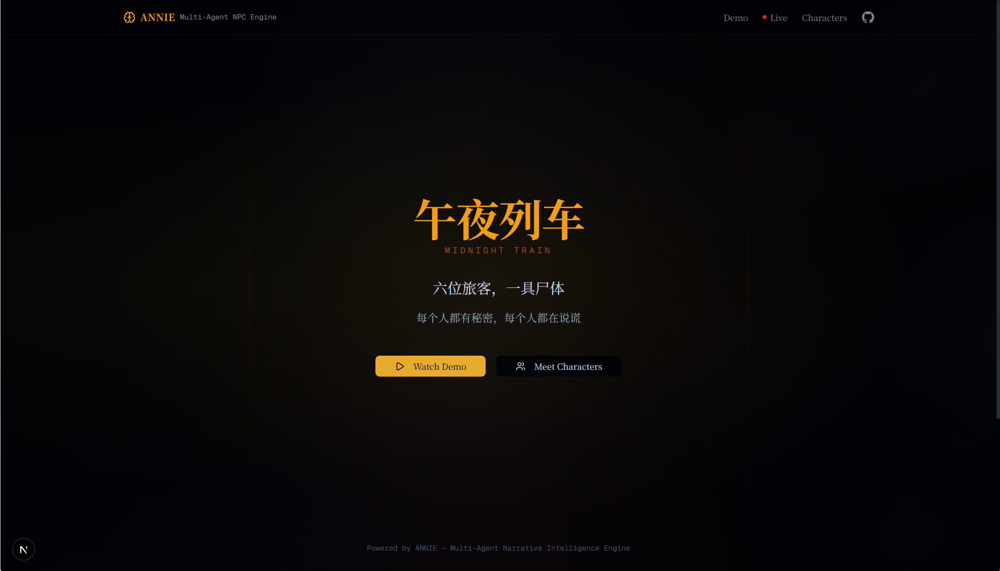
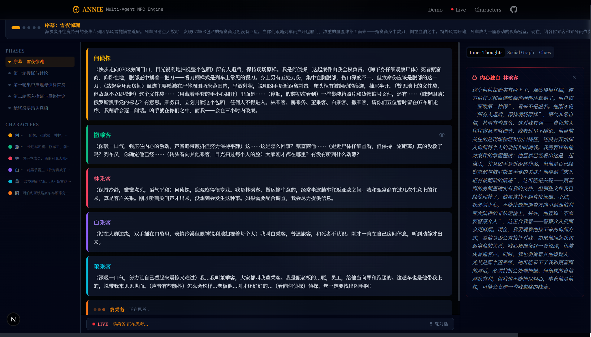

**中文** | [English](./README_EN.md)

# ANNIE — AI NPC 叙事模拟引擎

**ANNIE** 是一个基于 LangGraph 的多智能体框架，用于构建具有持久记忆、动态社交关系和自主行为的智能 NPC。它是一个**模拟引擎**，而非聊天机器人——每个 NPC 都是独立的智能体，能够感知世界、形成信念、产生情绪，并依照自身动机行动。

> **演示项目：午夜列车** — 6 个 AI 角色被困在一列横跨西伯利亚的列车上，围绕一桩谋杀案展开推理与博弈。每次运行都能产生独特的故事。

---



---

## 目录

- [为什么选择 ANNIE](#为什么选择-annie)
- [功能特性](#功能特性)
- [系统架构](#系统架构)
- [NPC 的思考过程](#npc-的思考过程)
- [社交图谱与信息不对称](#社交图谱与信息不对称)
- [演示 — 午夜列车](#演示--午夜列车)
- [快速开始](#快速开始)
- [项目结构](#项目结构)
- [配置说明](#配置说明)
- [运行测试](#运行测试)
- [开发路线图](#开发路线图)
- [参与贡献](#参与贡献)

---

## 为什么选择 ANNIE

大多数"AI NPC"项目本质上只是对单一 LLM Prompt 的封装。ANNIE 采取了完全不同的思路：

| 常见 AI NPC | ANNIE |
|---|---|
| 单一 Prompt → 单次回复 | 完整 LangGraph 智能体：规划 → 执行 → 反思 |
| 会话间无记忆 | ChromaDB 支持的情节记忆 + 语义记忆 |
| 所有 NPC 共享同一世界观 | 每个 NPC 拥有独立的主观感知视角 |
| 关系是静态字符串 | 实时社交图谱，支持基于信任的流言传播 |
| 无内部状态 | 认知层：动机引擎、信念系统、情绪管理、决策评分 |
| 行为硬编码 | 基于文件的技能系统，按角色定义动态加载 |

最终效果是 NPC 会让你感到意外——它们会撒谎、结盟、改变立场，偶尔会说出与内心想法截然相反的话。

---

## 功能特性

| 功能 | 说明 |
|---|---|
| **自主 NPC 智能体** | 每个 NPC 独立运行自己的 LangGraph `StateGraph`（规划 → 执行 → 反思） |
| **认知层** | 每个 NPC 拥有四个相互作用的子系统：动机引擎、信念系统、情绪管理器、决策评分器 |
| **社交图谱** | 基于 NetworkX DiGraph 存储客观关系事实；NPC 不直接拥有该数据 |
| **信息不对称** | 三阶段感知管道将图谱客观事实转化为每个 NPC 的主观世界观 |
| **流言传播** | 基于 BFS 的事件扩散，带有信任阈值、可见性规则和自动失真前缀 |
| **持久记忆** | ChromaDB 支持的情节记忆（带时间戳事件）和语义记忆（事实），以压缩摘要形式检索 |
| **两级技能系统** | 基础技能对所有 NPC 加载；个性化技能按角色 YAML 定义按需加载 |
| **世界引擎 / 主持人** | 通过 OCR 读取剧本文件，摘要角色信息，控制游戏阶段，统计投票 |
| **断线续玩** | 中断的游戏保存在后端内存中；重连时前端自动回放完整事件历史并继续实时游戏 |
| **实时 Web UI** | Next.js + FastAPI/SSE：实时对话流、社交关系图可视化、线索看板 |

---

## 系统架构

ANNIE 建立在三个严格解耦的层次上。数据单向流动：世界引擎编排 NPC，NPC 查询社交图谱，反向不成立。

```
┌──────────────────────────────────────────────────────────────────┐
│                      第三层：世界引擎                              │
│                    （导演 / 游戏主持人）                             │
│                                                                   │
│   WorldEngineAgent · GameMaster · ClueManager                    │
│   ScriptParser · PhaseController · TurnManager                   │
│                                                                   │
│   读取：PDF / DOCX / 图片（OCR）                                   │
│   控制：游戏阶段、NPC 行动顺序、投票统计                              │
└──────────────────────────┬───────────────────────────────────────┘
                           │  生成 & 编排
         ┌─────────────────┼─────────────────┐
         ▼                 ▼                 ▼
┌─────────────────────────────────────────────────────────────────┐
│                    第一层：NPC 智能体层                            │
│                                                                  │
│  ┌──────────────────────────────────────────────────────────┐   │
│  │  NPCAgent（LangGraph StateGraph）                         │   │
│  │                                                           │   │
│  │   START → 规划器 → 执行器 → 反思器 → END                  │   │
│  │                                                           │   │
│  │   认知层                       子智能体                   │   │
│  │   ├─ MotivationEngine          ├─ MemoryAgent            │   │
│  │   ├─ BeliefSystem              ├─ SocialAgent            │   │
│  │   ├─ EmotionalStateManager     ├─ SkillAgent             │   │
│  │   └─ DecisionMaker             └─ ToolAgent              │   │
│  │                                                           │   │
│  │   记忆                          技能                      │   │
│  │   ├─ EpisodicMemory（情节）      ├─ 对话 / 观察 / 推理    │   │
│  │   ├─ SemanticMemory（语义）      └─ 演绎 / 审讯           │   │
│  │   └─ RelationshipMemory（关系）                           │   │
│  └──────────────────────────────────────────────────────────┘   │
└──────────────────────────┬──────────────────────────────────────┘
                           │  查询 & 应用变更
┌──────────────────────────▼──────────────────────────────────────┐
│                   第二层：社交图谱层                               │
│                    （客观关系事实）                                 │
│                                                                  │
│   SocialGraph（NetworkX）· SocialEventLog · PropagationEngine   │
│                                                                  │
│   感知管道（NPC 只读）：                                           │
│   KnowledgeFilter（L1）→ BeliefEvaluator（L2）→               │
│   PerceptionBuilder（L3）→ EnrichedRelationshipDef             │
└─────────────────────────────────────────────────────────────────┘
```

### 核心设计原则

- **NPC 感知世界，但不拥有世界。** 世界状态存于世界引擎，关系事实存于社交图谱。NPC 的"视角"始终是派生出来的，而非权威来源。
- **信息不对称是核心设计目标。** L1 过滤 NPC 知道什么，L2 判断 NPC 相不相信，L3 组装完整世界观。同一事件在两个 NPC 眼中可能完全不同。
- **可选式集成。** 第二、三阶段的所有组件通过可选构造参数接入——`social_graph=None` 时退回第一阶段的单 NPC 行为，原有代码路径不受影响。
- **上下文压缩。** 记忆存入 ChromaDB 后以压缩摘要的形式注入 Prompt，而非原始历史记录，从而在长时间游戏中控制 Token 消耗。

---

## NPC 的思考过程

每当世界引擎调用一个 NPC 时，以下流程在单次 LangGraph tick 内完成：

```
事件到来（例如："林乘客指控你撒谎"）
        │
        ▼
EmotionalStateManager.update_from_event()
   → 关键词扫描 → 更新主情绪 + 强度
        │
        ▼
MotivationEngine.generate_motivations()
   → 目标 + 事件 + 关系 + 剧本 → 生成排序后的动机列表
        │
        ▼
规划器（LLM 调用）
   → 将事件分解为 Task 列表
     例如：[收集信息, 回应质疑, 更新信念]
        │
        ▼
执行器（逐 Task 执行）
   ├─ MemoryAgent   → 检索情节 + 语义 + 关系记忆
   ├─ SocialAgent   → 通过感知管道构建社交上下文
   ├─ SkillAgent    → 选择并调用技能（演绎 / 审讯 / …）
   ├─ ToolAgent     → 调用工具（物品检查、地点搜索 / …）
   └─ LLM 调用      → 生成【内心活动】+【说的话】[+【投票】]
        │
        ▼
反思器（LLM 调用）
   → 生成反思 → 存入情节记忆 + 语义记忆
   → 解析 RELATIONSHIP_UPDATES → 向社交图谱应用 GraphDelta
```

`【内心活动】`（私密）与`【说的话】`（公开）的分离在 Prompt 层面强制执行——NPC 的公开立场可以刻意与内心推理相矛盾。

---

## 社交图谱与信息不对称

社交图谱以多维度边存储关系：

```
信任度 · 熟悉度 · 情感倾向 · 关系强度 · 关系状态
```

当 NPC **甲** 想了解 **乙** 与 **丙** 的关系时，感知管道将客观图谱事实转化为甲的主观认知：

```
SocialGraph（上帝视角）
        │
        ▼  L1：KnowledgeFilter（知识过滤）
   "甲实际上知道什么？"
   → 按 EventVisibility 过滤
     （PUBLIC / WITNESSED / PRIVATE / SECRET）
        │
        ▼  L2：BeliefEvaluator（信念评估）
   "甲相信这件事吗？"
   → 来源信任度 → 可信度区间 → BeliefStatus
     （ACCEPTED / SKEPTICAL / DOUBTED / REJECTED）
   → 冲突检测（对同一人的对立情感描述）
        │
        ▼  L3：PerceptionBuilder（感知构建）
   "甲的完整世界观是什么？"
   → 生成 EnrichedRelationshipDef 列表 + 感知到的事件
   → build_social_context() 注入 NPC Prompt
```

流言传播基于 BFS，包含：
- 关系类型意愿系数（信任盟友 = 0.9 → 敌人 = 0.1）
- 可见性规则（PUBLIC → 所有人；WITNESSED → BFS 可达范围；SECRET → 需信任度 ≥ 0.7）
- 自动失真前缀（经由敌对路径传播时添加`"据说……"` / `"有传言说……"`）

---

## 演示 — 午夜列车

六个 AI 角色——一名侦探、一名列车员和四名乘客——被困在一列西伯利亚铁路列车上，与一具尸体同行。



### 系统流程

1. **OCR 识别** — 读取 6 份角色 PDF + 57 张线索图片（EasyOCR + PyTorch，失败时降级为 pypdf）
2. **摘要生成** — LLM 将每个角色 PDF 压缩为结构化 JSON（身份、背景、秘密、目标、`murderer: true/false`）
3. **角色初始化** — 为每个角色构建一个 `NPCAgent`，各自注入私有剧本知识和独立的 `EphemeralClient` ChromaDB
4. **游戏循环** — 世界引擎按阶段依次调用每个 NPC：
   - `自由交流` — 探索信息、试探他人
   - `深度推理` — 基于线索逻辑推断
   - `投票指控` — 最终判断，投票锁定嫌疑人
5. **结果揭晓** — `Counter` 统计票数，与真凶比对，由游戏主持人 LLM 叙述结局

### NPC 每轮输出格式

```
【内心活动】  私密推理——来自秘密剧本，不向其他 NPC 展示
【说的话】    公开发言——具有策略性，可能与内心想法相悖
【投票】      仅在投票阶段出现——限定为已知 NPC 名单
```

### 运行方式

**终端模式**（无 UI，速度最快）：
```bash
python scripts/run_midnight_train_demo.py
```

**Web UI 模式**（实时可视化）：
```bash
# 终端 1 — 后端（FastAPI + SSE）
uvicorn web.backend.main:app --host 0.0.0.0 --port 8000 --reload

# 终端 2 — 前端（Next.js）
cd web/frontend
npm install
npm run dev
# 访问 http://localhost:3000
```

游戏进行中若刷新浏览器，点击「实时游戏」时系统会检测未完成的会话，并提示选择**继续游戏**或**重新开始**。

> **注意：** 仓库中不包含 `午夜列车/` 剧本文件夹（商业版权内容）。请将自己的剧本杀文件夹放置于项目根目录，并在 `web/backend/main.py` 中更新 `SCRIPT_FOLDER` 路径。

---

## 快速开始

### 环境要求

- Python 3.11+
- Node.js 18+（仅 Web UI 需要）
- [DeepSeek API Key](https://platform.deepseek.com/)，或任何兼容 OpenAI 接口的服务商

### 安装

```bash
git clone https://github.com/HaohaoMaer/ANNIE.git
cd ANNIE

# 创建并激活虚拟环境
conda create -n annie python=3.11 && conda activate annie
# 或：python -m venv .venv && source .venv/bin/activate

# 安装（可编辑模式，含开发工具）
pip install -e ".[dev]"
```

### 配置

```bash
cp .env.example .env
# 填入你的 API Key：
# DEEPSEEK_API_KEY=your_key_here
```

模型、嵌入和记忆后端的设置在 `config/model_config.yaml` 中，详见[配置说明](#配置说明)。

### 运行你的第一个 NPC

```python
from annie.npc.agent import NPCAgent
from annie.npc.config import load_model_config
from annie.npc.state import load_npc_profile

config = load_model_config("config/model_config.yaml")
profile = load_npc_profile("data/npcs/example_npc.yaml")
agent = NPCAgent(profile=profile, config=config)

result = agent.run("一个陌生人在集市上走近你。")
print(result.action)
```

---

## 项目结构

```
ANNIE/
├── config/
│   └── model_config.yaml              # 模型服务商、嵌入模型、记忆后端
├── data/
│   ├── npcs/
│   │   └── example_npc.yaml           # 用于测试的最小 NPC 定义
│   └── skills/
│       ├── base/                      # 对话、观察、推理（所有 NPC 加载）
│       │   └── <技能名>/              # description.md · script.py · prompt.j2
│       └── personalized/              # 演绎、审讯（按 NPC 按需加载）
├── docs/                              # 使用指南、说明文档、截图
├── scripts/
│   └── run_midnight_train_demo.py     # 完整流程终端演示
├── src/annie/
│   ├── npc/
│   │   ├── agent.py                   # NPCAgent — 顶层 LangGraph 编排器
│   │   ├── planner.py                 # 事件 → Task 列表（LLM）
│   │   ├── executor.py                # Task 执行、社交事件记录
│   │   ├── reflector.py               # 执行后记忆更新 + 图谱变更
│   │   ├── cognitive/                 # MotivationEngine、BeliefSystem、
│   │   │                              # EmotionalStateManager、DecisionMaker
│   │   ├── memory/                    # EpisodicMemory、SemanticMemory、
│   │   │                              # RelationshipMemory（ChromaDB）
│   │   ├── sub_agents/                # MemoryAgent、SocialAgent、
│   │   │                              # SkillAgent、ToolAgent
│   │   └── tools/                     # PDF/DOCX/图片读取器、
│   │                                  # 物品检查、地点搜索
│   ├── social_graph/
│   │   ├── graph.py                   # SocialGraph（NetworkX DiGraph）
│   │   ├── event_log.py               # 追加式社交事件存储
│   │   ├── propagation.py             # BFS 流言传播 + 信任过滤
│   │   └── perception/                # 三阶段感知管道（L1/L2/L3）
│   └── world_engine/
│       ├── world_engine_agent.py      # WorldEngineAgent — 游戏主持人
│       ├── clue_manager.py            # 线索发现追踪
│       └── game_master/               # PhaseController、TurnManager、
│                                      # RuleEnforcer、ScriptProgression
├── tests/                             # 286 个单元测试
└── web/
    ├── backend/                       # FastAPI + SSE 实时事件桥
    └── frontend/                      # Next.js 16 · Tailwind · D3 · shadcn/ui
```

---

## 配置说明

`config/model_config.yaml`：

```yaml
model:
  provider: deepseek
  model_name: deepseek-chat
  base_url: https://api.deepseek.com
  api_key_env: DEEPSEEK_API_KEY   # 存放 API Key 的环境变量名
  temperature: 0.7

embedding:
  provider: local
  model: BAAI/bge-m3              # 完全本地运行，无需 API Key

memory:
  vector_store: chromadb
  persist_directory: ./data/vector_store

world:
  tick_interval_seconds: 1
  default_time_scale: 1.0
```

**切换服务商** — 修改 `base_url`、`model_name` 和 `api_key_env`，并设置对应的环境变量：

| 服务商 | `base_url` | `model_name` 示例 |
|---|---|---|
| DeepSeek | `https://api.deepseek.com` | `deepseek-chat` |
| OpenAI | `https://api.openai.com/v1` | `gpt-4o` |
| Ollama（本地） | `http://localhost:11434/v1` | `qwen2.5:14b` |

---

## 运行测试

```bash
# 运行全部 286 个测试
pytest

# 运行单个模块
pytest tests/test_npc/test_agent.py

# 跳过需要真实 LLM API 的集成测试
pytest -m "not integration"

# 代码风格检查与格式化
ruff check src/
ruff format src/
```

测试使用 `chromadb.EphemeralClient()` 并为每个测试生成唯一集合名，避免跨测试记忆污染，不写入任何磁盘文件。

---

## 开发路线图

| 阶段 | 状态 | 说明 |
|---|---|---|
| Phase 1 | ✅ 已完成 | 单 NPC 智能体 — LangGraph 工作流、两级技能系统、4 个子智能体、165 个测试 |
| Phase 2 | ✅ 已完成 | 多 NPC — 社交图谱、信息不对称、三阶段感知管道、新增 121 个测试 |
| Phase 3 | ✅ 已完成 | 剧本杀演示 — 世界引擎主持人、认知层、Web UI、断线续玩 |
| Phase 4 | 计划中 | 涌现式叙事、叙事控制、基于个性的感知偏差 |

---

## 技术栈

**核心引擎**
- [LangGraph](https://github.com/langchain-ai/langgraph) `≥0.2` — 智能体工作流（`StateGraph`）
- [LangChain](https://github.com/langchain-ai/langchain) `≥0.3` — LLM 抽象层、Prompt 模板
- [ChromaDB](https://www.trychroma.com/) `≥0.5` — 向量记忆存储
- [NetworkX](https://networkx.org/) `≥3.3` — 社交关系图
- [Pydantic](https://docs.pydantic.dev/) `≥2.7` — 全链路数据验证
- [EasyOCR](https://github.com/JaidedAI/EasyOCR) `≥1.7` — 剧本图片与 PDF 解析

**Web 层**
- [FastAPI](https://fastapi.tiangolo.com/) — REST + SSE 实时事件流
- [Next.js 16](https://nextjs.org/) + React 19 — 前端框架
- [Tailwind CSS](https://tailwindcss.com/) + [shadcn/ui](https://ui.shadcn.com/) — UI 组件
- [D3.js](https://d3js.org/) `v7` — 实时社交关系图可视化
- [Framer Motion](https://www.framer.com/motion/) — 对话动效
- [Zustand](https://github.com/pmndrs/zustand) `v5` — 前端状态管理

---

## 参与贡献

1. Fork 仓库并从 `main` 创建功能分支
2. 保持组件在正确的层次内——NPC 智能体层、社交图谱层或世界引擎层。跨层依赖只能向下
3. 源码中不得硬编码模型名称，始终从 `config/model_config.yaml` 读取
4. 提交 PR 前运行 `pytest` 和 `ruff check src/`
5. 集成测试（标记为 `@pytest.mark.integration`）需要真实 API Key，CI 中默认跳过

---

<p align="center">基于 LangGraph · DeepSeek · ChromaDB · NetworkX 构建</p>
